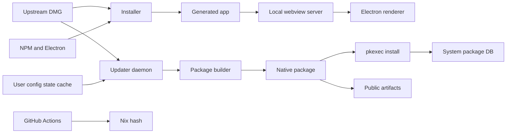

# Codex App Linux Threat Model

Date: 2026-04-25

## Executive Summary

The highest-risk themes are supply-chain integrity, local privilege transition, and renderer containment. The system is a local desktop packaging/conversion pipeline, but it publicly distributes native package artifacts and ships an intended auto-update path that downloads a mutable upstream DMG, rebuilds a Linux package, and installs it through `pkexec`. The most important review focus is therefore the path from upstream artifact trust to root-owned package install, followed by the Electron sandbox/webview local-origin boundary.

## Scope and Assumptions

In scope:

- `install.sh`
- `scripts/`
- `packaging/linux/`
- `updater/`
- `.github/workflows/`
- `flake.nix`, `flake.lock`, `Cargo.toml`, `Cargo.lock`
- User-facing and maintainer docs that describe runtime/update behavior

Out of scope:

- The generated `codex-app/` tree, because it was absent during this review.
- The cached `Codex.dmg`, because it was absent during this review.
- Live reverse engineering of the upstream Electron app bundle, BrowserWindow settings, IPC handlers, CSP, and Apple signature/notarization state.

Assumptions validated with the maintainer:

- Updater auto-install after app exit is intended behavior.
- Native package artifacts will be made available for public distribution.
- Mutable upstream payload trust is a supply-chain risk, even if the upstream DMG may be signed; the Linux pipeline must verify the relevant signature or trusted metadata itself.
- Local same-user processes are realistic attackers for localhost, cache/state, and PATH abuse paths.
- LAN attackers are relevant if future local services bind beyond loopback.

Open questions that would materially change risk ranking:

- What exact code-signing or notarization signal is available on the upstream DMG, and can it be verified on Linux before extraction?
- Does the generated upstream Electron app enforce `contextIsolation: true`, `nodeIntegration: false`, `sandbox: true`, navigation allowlists, and safe `openExternal` handling?
- Will public artifacts be distributed only through GitHub Releases, a package repository, or both?

## System Model

### Primary Components

- Upstream artifact source: `https://persistent.oaistatic.com/codex-app-prod/Codex.dmg`, referenced by `install.sh`, updater config, and Nix.
- Local installer: `install.sh` downloads/extracts the DMG, patches ASAR content, rebuilds native modules, downloads Electron for Linux, extracts the webview, and writes `codex-app/start.sh`.
- Generated launcher: `codex-app/start.sh` starts the webview server, performs CLI preflight, and launches Electron.
- Local webview server: Python `http.server` bound to `127.0.0.1` on port `5175`, serving `content/webview`.
- Updater daemon: `codex-app-updater daemon` runs as a `systemd --user` service, checks upstream metadata, downloads DMGs, rebuilds packages, and coordinates install state.
- Privileged install boundary: updater invokes `pkexec codex-app-updater install-* --path <package>` for final package manager installation.
- Package builders: shell scripts build Debian, RPM, and pacman artifacts from generated app trees.
- CI hash workflow: GitHub Actions refreshes the Nix fixed-output hash.
- Public artifact channel: native packages intended for public distribution.

### Data Flows And Trust Boundaries

- Internet -> Installer/updater: DMG bytes and HTTP metadata cross HTTPS. Current guarantees are TLS and post-download hashing; no repo-enforced signature or trusted manifest verification is visible.
- Internet -> NPM/Electron tooling: npm package metadata/tarballs and Electron zip bytes cross HTTPS during non-Nix builds. Current guarantees are registry/CDN TLS and npm client behavior; no checked-in lockfile/manifest pins the full build toolchain.
- Upstream DMG -> ASAR patcher/package builder: app bundle, Info.plist, node modules, and webview assets cross from vendor artifact into local generated app tree. Current validation checks package-version string shape, not artifact authenticity.
- Launcher -> Local webview server -> Electron renderer: static webview assets cross localhost HTTP on fixed port `5175`. Current validation checks two marker strings, not a nonce or signed asset manifest.
- User config/state/cache -> Updater daemon: TOML config and JSON state cross from user-writable XDG paths into update decisions. Current validation is schema parsing and some path/version shape checks.
- Updater daemon -> Package builder scripts: user-service environment and downloaded DMG cross into shell scripts. Current subprocess calls avoid shell interpolation in Rust, but PATH is inherited.
- Updater daemon -> `pkexec` -> system package manager: package path crosses from unprivileged user context into privileged install. Current controls are polkit authorization and limited metadata checks; artifact path/digest are not strongly bound.
- CI runner -> maintainer review -> `main`: workflow downloads a mutable DMG, computes a hash, edits `flake.nix`, and opens or updates a PR. Current controls are GitHub workflow permission, pinned workflow actions, and maintainer review before merge.
- Maintainer build host -> Public users: `.deb`, `.rpm`, and pacman artifacts cross from local build output into public distribution. Current repo lacks signing/provenance workflow.

#### Diagram

## Assets And Security Objectives

- User workstation account: preserve confidentiality and integrity of local files and processes.
- Root-owned package database and `/opt/codex-app`: prevent unauthorized package install, downgrade, or root-owned payload tampering.
- Updater state/config/cache: prevent artifact substitution, malicious builder selection, and misleading recovery state.
- Public packages: ensure recipients can verify origin, integrity, and provenance.
- Upstream Codex app and CLI authenticity: ensure Linux conversion uses genuine, reviewed upstream inputs.
- Electron renderer boundary: keep Chromium sandboxing and Electron isolation controls in place so XSS/webview compromise does not become host compromise.
- Logs and state: avoid persisting secrets embedded in configured URLs or subprocess errors.

## Attacker Model

Capabilities:

- Same-user local process can bind localhost ports, modify user cache/state/config, influence user PATH, and race user-owned files.
- LAN attacker can connect to any future local services that bind on non-loopback interfaces.
- Network or supply-chain attacker can compromise or influence mutable upstream distribution, npm registry artifacts, Electron release artifacts, GitHub Actions dependencies, or public package release storage.
- Public package consumer may verify artifacts only with metadata this project publishes.

Non-capabilities:

- No assumption of remote pre-auth access to a network service exposed by this repo, except any accidental local webview server exposure.
- No assumption that attacker already has root.
- No assumption that upstream Codex credentials, OpenAI accounts, or backend services are controlled by this repo.
- No claim about generated Electron IPC/webPreferences without inspecting `codex-app/`.

## Threat Enumeration And Prioritization

### T1: Malicious upstream DMG becomes a trusted Linux package

- Entry points: `dmg_url`, `install.sh` download, updater download, CI hash workflow.
- Abuse path: attacker controls or compromises upstream payload path -> updater downloads bytes -> hash is recorded but not verified against trusted metadata -> builder converts payload to native package -> auto-install applies it after app exit.
- Likelihood: Medium. It requires upstream/CDN/workflow compromise or malicious config, but the URL is mutable and auto-install is intended.
- Impact: High. A malicious package can alter root-owned app files and run user-context Electron/updater code persistently.
- Priority: High.
- Existing mitigations: HTTPS; Nix fixed-output hash for Nix path; post-download hash recording.
- Gaps: no signed manifest or Linux-enforced verification of upstream signature/notarization before rebuild.
- Recommendations: signed update metadata, maintainer-reviewed hash acceptance for public channels, explicit signature verification before extraction, and auto-install gating on verified metadata.

### T2: Local package path substitution crosses the `pkexec` boundary

- Entry points: updater state `artifact_paths.package_path`, CLI `install-* --path`, user cache workspace.
- Abuse path: attacker with same-user access modifies or races package artifact path -> privileged install validates insufficient metadata or validates then installs later path -> package manager installs attacker-controlled package as root.
- Likelihood: Medium. Requires same-user access and polkit authorization timing, but same-user local processes are in scope.
- Impact: High. Successful abuse writes root-owned package payloads and package scripts.
- Priority: High.
- Existing mitigations: `pkexec` authorization; argument-based subprocess calls; symlink/non-file rejection; expected `codex-app` filename shapes; private staged-copy install; Debian/pacman version checks.
- Gaps: caller-supplied path acceptance, weak RPM metadata validation, no root-trusted digest binding.
- Recommendations: digest/identity binding to trusted updater state, canonical path checks under expected workspace, and RPM metadata parity.

### T3: Renderer compromise escapes meaningful containment if generated app settings are unsafe

- Entry points: webview content, upstream app content, local fixed HTTP origin, possible IPC/openPath handlers.
- Abuse path: attacker gets malicious content served to renderer or exploits upstream renderer bug -> generated app has unsafe `webPreferences`, IPC, navigation, or explicit sandbox disablement -> attacker operates with user account privileges.
- Likelihood: Medium. Requires renderer content compromise or local-origin spoofing, but local webview spoofing is plausible.
- Impact: High. User files, tokens, CLI config, and local processes are exposed.
- Priority: High.
- Existing mitigations: launcher keeps Chromium sandboxing enabled by default and has no Node-related flags visible; upstream app settings remain unverified.
- Gaps: absent generated-app review and explicit lower-security sandbox opt-out.
- Recommendations: verify `contextIsolation`, `nodeIntegration`, sandbox, navigation/window/openExternal policy, and inspect generated app bundle as a release gate.

### T4: Local webview origin is spoofed

- Entry points: fixed port `5175`, Python `http.server`, marker-based origin validation.
- Abuse path: local process occupies or races port -> marker-matching malicious HTML is served -> Electron loads attacker page as expected local origin.
- Likelihood: Medium for local spoofing.
- Impact: Medium, High when combined with T3.
- Priority: Medium.
- Existing mitigations: explicit `127.0.0.1` bind, no broad process killing, and marker checks for expected `index.html` strings.
- Gaps: fixed port, weak validation, no nonce.
- Recommendations: use random port/nonce where possible and validate asset manifest hashes.

### T5: CI or public artifact channel distributes unreviewed trusted payloads

- Entry points: scheduled hash workflow and public package release artifacts.
- Abuse path: workflow or upstream payload is compromised -> hash PR or artifacts are updated/published -> public users consume artifacts without signatures/provenance.
- Likelihood: Medium for supply-chain exposure over time.
- Impact: High because public users rely on repo-published trust decisions.
- Priority: High.
- Existing mitigations: Nix hash syntax validation, PR-based hash refresh, and commit-pinned workflow actions.
- Gaps: no package signing/attestation and no automated upstream signature/notarization evidence in hash PRs.
- Recommendations: release checksums/signatures, artifact attestations, upstream signature/notarization verification output, and documented verification instructions.

### T6: Build environment influences package contents

- Entry points: imported `PATH`, `builder_bundle_root`, npm/npx resolution, generated app payload staging.
- Abuse path: user config or PATH points updater at malicious tooling/scripts -> local rebuild emits compromised package -> package is offered for privileged install or public distribution.
- Likelihood: Medium for developer/local systems; lower for locked packaged systems if config is hardened.
- Impact: Medium to High depending whether package is installed locally or published.
- Priority: Medium.
- Existing mitigations: required builder files are copied from a configured root; Rust uses argument vectors.
- Gaps: packaged mode accepts custom builder roots and inherited PATH; package payload metadata is not normalized.
- Recommendations: fixed build PATH, root-owned builder root in packaged mode, developer-mode gate for custom builders, symlink/mode normalization.

### T7: Logs and state expose sensitive configured URLs or command output

- Entry points: `dmg_url`, npm/package-manager stderr, state and service logs.
- Abuse path: operator configures URL with userinfo or token query -> failure paths persist full URL or stderr to state/logs.
- Likelihood: Low. Default URL has no secret.
- Impact: Low to Medium depending token sensitivity.
- Priority: Low.
- Existing mitigations: no hardcoded secrets found.
- Gaps: no URL userinfo rejection or redaction.
- Recommendations: reject userinfo, redact query values and credential-looking stderr before persistence.

### T8: NPM latest-state trust changes runtime CLI behavior

- Entry points: launcher CLI preflight, `npm view @openai/codex version`, automatic npm install/upgrade.
- Abuse path: npm account, registry, transport, or unexpected upstream release is compromised -> updater observes a new latest CLI version -> updater installs that version globally or under `~/.local` -> Electron launches with the new CLI path.
- Likelihood: Medium. It depends on npm/upstream compromise or an unwanted release, but the check is part of normal prelaunch behavior.
- Impact: Medium. The CLI runs with user privileges and can affect Codex app behavior and local files, though it does not directly cross the root package-install boundary.
- Priority: Medium.
- Existing mitigations: missing-CLI installation requires interactive launcher consent; installs use an exact version returned by npm rather than a floating spec.
- Gaps: no repo-reviewed allowlist, no npm provenance verification, and upgrades can occur during preflight.
- Recommendations: require explicit consent for upgrades, support an approved-version channel, verify npm provenance/signatures where available, and log the chosen version/digest.

## Mitigations And Recommendations

High-priority implementation targets:

- Verify upstream artifacts before extraction: signed manifest or verified upstream signature/notarization, with explicit failure if verification cannot run.
- Harden privileged installs further: package identity/digest validation, canonical workspace path, and RPM parity with Debian/pacman checks.
- Inspect generated app security settings before public release.
- Add upstream version/build metadata and signature/notarization verification to hash-update PRs.
- Add public artifact signing, checksums, attestations, and verification docs.

Medium-priority implementation targets:

- Remove fixed-port webview spoofing where feasible.
- Sanitize service/build PATH and lock packaged builder root.
- Normalize package payload permissions and reject unsafe symlinks.
- Keep updater download timeout and maximum-size checks covered by regression tests.
- Add service hardening directives compatible with `systemd --user`.

Detection and monitoring:

- Log artifact URL host, version, digest, signature verification result, and package path/digest without storing secrets.
- Log and notify when `builder_bundle_root` or `dmg_url` differ from packaged defaults.
- Publish release provenance and expected artifact hashes for public users.

## Focus Paths For Manual Security Review

- `install.sh`: launcher generation, sandbox flags, webview server, DMG/Electron/npm downloads.
- `scripts/patch-linux-window-ui.js`: ASAR patching and file-open behavior injected into upstream code.
- `updater/src/upstream.rs`: DMG download, hashing, timeouts, and future signature verification.
- `updater/src/app.rs`: auto-install orchestration, state transitions, and `pkexec` invocation.
- `updater/src/install.rs`: privileged install subcommands, path validation, version checks, and TOCTOU controls.
- `updater/src/builder.rs`: builder root trust, inherited PATH, package artifact discovery.
- `updater/src/config.rs`: production vs developer-mode configuration boundaries.
- `updater/src/codex_cli.rs`: npm latest checks and automatic CLI install/upgrade.
- `updater/src/state.rs`: artifact path persistence and state-file trust.
- `packaging/linux/codex-app-updater.service`: user-service sandboxing and environment.
- `packaging/linux/packaged-runtime.sh`: imported environment and updater service startup.
- `packaging/linux/codex-app-updater-user-service.sh`: maintainer-script user-manager operations.
- `scripts/lib/package-common.sh`: package payload staging and metadata normalization.
- `scripts/build-deb.sh`: Debian package generation and public signing/provenance hooks.
- `scripts/build-rpm.sh`: RPM staging, direct payload copy, and signing hooks.
- `scripts/build-pacman.sh`: pacman staging, `--skipinteg`, and package signing hooks.
- `.github/workflows/update-codex-hash.yml`: CI trust-root updates and action pinning.
- `flake.nix`: Nix fixed-output hash trust and Nix-specific binary patching.
- `packaging/linux/control`: public package dependency footprint.
- `packaging/linux/PKGBUILD.template`: Arch dependency footprint and package metadata.

## Quality Check

- Covered discovered runtime entry points: installer, launcher, local webview server, updater daemon, CLI preflight, package builders, CI workflow.
- Covered each trust boundary in at least one threat: internet downloads, generated app assets, localhost HTTP, user config/state/cache, unprivileged updater to privileged install, CI to main, public artifacts.
- Separated runtime behavior from CI/build/dev tooling.
- Reflected user clarifications: auto-install is intended, public distribution is intended, mutable upstream payload trust is a supply-chain risk.
- Kept assumptions and open questions explicit, especially absent generated app and unverified upstream signing state.
