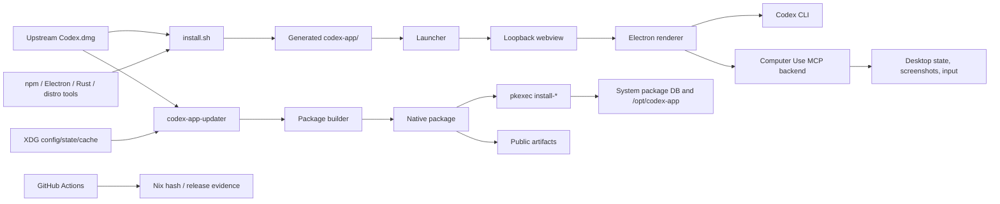

# Codex App Linux Threat Model

Date: 2026-05-01

This repository adapts the official OpenAI `Codex.dmg` into a Linux Electron
app, builds native Linux packages, and ships `codex-app-updater` to check,
rebuild, and install local updates. This threat model is repository-scoped and
feeds future `@codex-security` reviews. Track actionable implementation work in
[Security Backlog](security-backlog.md).

## Executive Summary

The highest-risk areas are:

1. **Mutable upstream artifact trust.** The installer and updater convert an
   upstream DMG into a local Linux app and package. A bad upstream artifact,
   wrong trust root, compromised download, or stale verification result can
   become a root-owned package.
2. **Privilege transition.** The updater is intentionally unprivileged until it
   invokes `pkexec` install subcommands. Anything crossing that boundary must be
   tightly bound to a verified package identity and digest.
3. **Desktop and renderer containment.** The generated Electron app, local
   webview server, Codex CLI, and Linux Computer Use backend all run with the
   user's desktop privileges. A renderer, plugin, localhost, or CLI compromise
   can affect local files, screenshots, input, and user processes.

The repository already has meaningful hardening: HTTPS-only non-loopback DMG
URLs, URL redaction, partial downloads, package metadata checks, private staged
install copies, package payload symlink rejection, package mode normalization,
builder-root permission checks, default-enabled Electron sandboxing, release
gate checks, and Apple DMG verification tooling. The remaining critical gaps
are trusted upstream metadata, digest binding for privileged installs, generated
app security review evidence, and public artifact provenance.

## Scope

In scope:

- Installer and generated launcher sources: `install.sh`,
  `launcher/start.sh.template`, and `scripts/lib/`.
- ASAR and generated-app inspection tooling:
  `scripts/patch-linux-window-ui.js`,
  `scripts/patch-linux-window-ui.test.js`, and
  `scripts/inspect-electron-security.js`.
- Native package builders and templates: `scripts/build-deb.sh`,
  `scripts/build-rpm.sh`, `scripts/build-pacman.sh`, `scripts/lib/package-common.sh`,
  and `packaging/linux/`.
- Updater service and CLI: `updater/`, `updater/Cargo.toml`, and updater tests.
- Linux Computer Use backend and bundled plugin resources:
  `computer-use-linux/` and `plugins/openai-bundled/plugins/computer-use/`.
- Release, CI, and Nix trust roots: `.github/workflows/`, `Makefile`,
  `flake.nix`, `flake.lock`, `Cargo.toml`, and `Cargo.lock`.
- Maintainer docs that define security workflow, package behavior, and fork
  contracts.

Generated/runtime artifacts are security-relevant but are not durable source:
`codex-app/`, `codex-*-app/`, `dist/`, `Codex.dmg`, and XDG config/state/cache
paths. Inspect them when validating behavior, but fix source scripts, package
templates, updater code, or workflows.

Out of scope:

- Security guarantees made by OpenAI backend services, account rollout policy,
  or the upstream macOS app outside the local conversion and packaging path.
- Claims about a specific generated `app.asar` bundle until it has been built
  from a specific DMG and inspected.
- Host package-manager, polkit, npm registry, Electron release, GitHub Actions,
  and Nix infrastructure internals except as external trust dependencies.

## Assumptions

- Native package artifacts are intended for local use and may be distributed
  publicly.
- Updater auto-install after app exit is intentional.
- The upstream DMG URL is mutable. TLS and a recorded SHA-256 are not enough by
  themselves to authenticate a release for unattended rebuild and install.
- Same-user local processes are realistic attackers for localhost ports,
  user-writable config/state/cache, environment, and PATH influence.
- A malicious renderer, plugin, CLI, or same-user process can matter even when
  it cannot directly become root.
- LAN attackers matter if any future local service binds beyond loopback.

Open questions that materially affect risk:

- What signed manifest, notarization, or equivalent trusted metadata can be
  verified before extracting a DMG on Linux?
- What exact Electron `webPreferences`, IPC, navigation, CSP, and
  `openExternal`/`openPath` behavior does each generated app bundle expose?
- What public artifact channel will be canonical: GitHub Releases, a package
  repository, Nix inputs, or a combination?
- What privilege and consent boundary should Linux Computer Use enforce when
  account-side gating enables it?

## System Model

### Primary Surfaces

- **Upstream artifact source:** default
  `https://persistent.oaistatic.com/codex-app-prod/Codex.dmg`, plus explicit
  local or configured DMG overrides.
- **Installer:** downloads or reuses the DMG, extracts `Codex.app`, patches
  ASAR/webview/runtime behavior, rebuilds native modules, downloads Linux
  Electron, stages bundled plugins, and writes `codex-app/start.sh`.
- **Generated launcher:** starts the local webview server, discovers or
  preflights the Codex CLI, loads packaged runtime behavior when installed,
  records app/webview liveness, and launches Electron.
- **Local webview server:** serves extracted webview assets on loopback port
  `5175` by default and validates startup markers before Electron launch.
- **Linux Computer Use backend:** Rust MCP backend and plugin resources that can
  inspect accessibility state, capture screenshots, and synthesize desktop
  input when upstream UI/account gating enables the feature.
- **Native package builders:** convert a generated app tree into `.deb`, `.rpm`,
  or pacman packages under the `codex-app` identity.
- **Updater daemon:** `codex-app-updater daemon` runs as a `systemd --user`
  service, checks upstream metadata, downloads DMGs, rebuilds packages, tracks
  state, prompts/notifies, and coordinates install after app exit.
- **Privileged install commands:** `codex-app-updater install-deb`,
  `install-rpm`, and `install-pacman` are invoked through `pkexec` for the final
  system package-manager operation.
- **Release and CI workflows:** update Nix hashes, verify Apple DMGs on macOS,
  run package/test workflows, and support release-gate checksums and optional
  signatures.
- **Experimental user-local installer:** rootless integration under
  `contrib/user-local-install/`, using XDG user data and user services.

### Trust Boundaries

| Boundary | Crosses From | Crosses To | Security Concern |
| --- | --- | --- | --- |
| Upstream DMG | Internet/CDN/OpenAI artifact hosting | local installer, updater, Nix hash workflow | Authenticity, freshness, downgrade, malicious payload |
| Build toolchain | npm, Electron releases, Rust crates, distro tools, 7z/7zz | generated app and packages | Dependency compromise, unpinned downloads, malicious native modules |
| Generated app bundle | extracted upstream app and patched ASAR | Linux Electron runtime | Renderer isolation, IPC, navigation, local file access |
| Local webview origin | loopback HTTP server | Electron renderer | Same-user port spoofing, stale assets, marker spoofing |
| User config/state/cache | XDG user-writable files | updater decisions and rebuild inputs | Path substitution, stale state, developer-mode misuse, secret leakage |
| Updater rebuild | unprivileged user service | package builder scripts and artifacts | Builder-root trust, PATH/tool influence, package identity |
| Privileged install | unprivileged updater/package path | `pkexec` and system package manager | TOCTOU, package substitution, root-owned payload install |
| Desktop automation | Electron/plugin request | Computer Use MCP backend, AT-SPI, screenshot, ydotool/portal | Screenshot leakage, unintended input, command origin |
| Public release | maintainer/CI build output | users and package consumers | Signing, provenance, reproducibility, trust-root drift |

### Diagram

## Assets And Objectives

- **User workstation account:** protect local files, shell environment, Codex
  credentials, API tokens, screenshots, clipboard-like data, and user processes.
- **Root-owned package state:** protect the system package database,
  `/opt/codex-app`, `/usr/lib/codex-app`, launchers, service units, polkit
  policy, and package scripts.
- **Updater state and workspaces:** preserve accurate version, candidate,
  digest, artifact path, and install status across restarts and package
  upgrades.
- **Generated app integrity:** ensure the Linux app is built from the intended
  upstream DMG and reviewed patch set.
- **Renderer and desktop-control boundary:** keep Electron, webview, CLI, and
  Computer Use behavior constrained to intended user-consented actions.
- **Public artifact trust:** publish verifiable packages, checksums,
  signatures, and provenance where public consumers rely on this fork.
- **Logs and docs:** avoid persisting secrets, and keep security workflow and
  threat assumptions discoverable for future maintainers and agents.

## Attacker-Controlled Inputs

- Configured `dmg_url`, `builder_bundle_root`, `workspace_root`, `cli_path`,
  environment variables, and command-line options.
- User-writable updater state/cache, generated app trees, package outputs, and
  local build directories.
- Upstream DMG bytes, HTTP metadata, npm metadata/tarballs, Electron archives,
  Rust crates, distro package state, and CI workflow inputs.
- Local loopback ports and any marker-compatible content served by same-user
  processes.
- Generated ASAR/webview content, renderer messages, plugin manifests, and
  Computer Use requests.
- Package paths passed to privileged install subcommands.
- Subprocess stdout/stderr that may be written to service logs or state.

## Required Security Invariants

- DMGs used for release or unattended updater install must be authenticated by
  trusted metadata, not only fetched over TLS and hashed after download.
- Package versions must come from the OpenAI app bundle version unless a test
  override is explicit.
- `codex-app-updater` must stay unprivileged until the final install subcommand.
- Privileged install commands must install only validated `codex-app` packages
  whose identity and digest match updater-reviewed state.
- Package builders must reject unsafe symlinks, normalize modes, and avoid
  preserving local build ownership.
- Production updater builder roots must be package-owned, non-symlinked, and
  not group/world-writable; local builder overrides require explicit developer
  mode.
- The generated launcher must keep local services loopback-only unless a change
  deliberately rethinks the webview trust model.
- Electron sandboxing must remain enabled by default; disabling it is an
  explicit lower-security compatibility mode.
- Computer Use must remain locally scoped, account/host-gated, and bound to
  user-consented desktop-control semantics.
- Logs and state must not store credential-bearing URLs or credential-looking
  subprocess output.

## Threat Themes

### T1: Mutable DMG Becomes A Trusted Package

**Entry points:** default and configured DMG URLs, `Codex.dmg`, Nix hash
workflow, updater download path, release gate.

**Abuse path:** attacker compromises or redirects the mutable upstream artifact
or its metadata; the repo downloads and hashes the bytes; the updater or
maintainer build converts them into a native package; the package is installed
or published as trusted.

**Impact:** High. A malicious app package can persist in root-owned paths and
run user-context Electron/updater code.

**Existing mitigations:** HTTPS-only non-loopback updater URLs, userinfo
rejection, redacted URL logging, download size limits, partial downloads, Nix
fixed-output hash, release-gate hash check, Apple DMG verification script and
workflow.

**Gaps:** No Linux-enforced signed manifest or trusted upstream metadata before
updater rebuild/install; hash-refresh PRs still need machine-attached upstream
version/signature evidence.

**Priority:** High.

### T2: Package Substitution Crosses The `pkexec` Boundary

**Entry points:** updater state package paths, `install-* --path`, user cache
workspaces, package files in `dist/`.

**Abuse path:** same-user attacker swaps or races a package path before the
privileged install; metadata validation succeeds on one file but the package
manager installs another, or the validated file is not bound to updater state.

**Impact:** High. Successful abuse writes root-owned package payloads or runs
package scripts as part of system package installation.

**Existing mitigations:** `pkexec`, argument-vector subprocess calls,
symlink/non-file rejection, expected filename shapes, private staged copies,
format-specific package-name metadata checks, Debian/pacman version checks.

**Gaps:** No root-trusted package digest binding to updater-reviewed state, and
manual install paths still accept caller-supplied package locations.

**Priority:** High.

### T3: Builder Or Toolchain Input Alters Package Contents

**Entry points:** packaged update-builder bundle, developer-mode builder roots,
PATH and package-manager tools, npm/Electron/Rust dependencies, generated app
payload.

**Abuse path:** attacker controls builder scripts, helper binaries, dependency
downloads, or generated payload contents; the updater or maintainer build emits
a compromised package.

**Impact:** Medium to High, depending on whether the package is installed
locally or distributed publicly.

**Existing mitigations:** packaged builder-root restrictions, developer-mode
guard for builder redirection, fixed updater rebuild PATH, Rust subprocess
argument vectors, builder bundle symlink and mode checks, package payload
symlink rejection, package mode normalization.

**Gaps:** non-Nix build dependencies still rely heavily on live registries and
tool downloads; developer mode intentionally trusts local builder roots.

**Priority:** Medium.

### T4: Renderer Or Local Webview Origin Escapes Containment

**Entry points:** generated ASAR/webview content, loopback webview server,
fixed port `5175`, renderer IPC, `openExternal`/`openPath`, sandbox opt-out.

**Abuse path:** malicious or spoofed local content is served to Electron, or a
renderer bug reaches unsafe IPC/navigation/file-opening behavior; sandboxing or
context isolation is disabled or insufficient.

**Impact:** High for user account compromise; higher if combined with package
or updater trust failures.

**Existing mitigations:** loopback bind, startup marker checks, live app marker
preservation, default-enabled Chromium sandboxing, explicit
`CODEX_APP_DISABLE_ELECTRON_SANDBOX` opt-out, static
`scripts/inspect-electron-security.js` release-gate inspection.

**Gaps:** fixed port and marker checks are spoofable by same-user processes;
generated bundle IPC, CSP, navigation, and Electron `webPreferences` require
review for each public release candidate.

**Priority:** High.

### T5: Computer Use Backend Exposes Desktop Control

**Entry points:** bundled Computer Use plugin, Rust MCP backend, accessibility
tree requests, screenshot paths, XDG portal/GNOME Shell DBus, ydotool/input
backends.

**Abuse path:** malicious renderer, plugin request, compromised upstream bundle,
or confused account-side flow invokes desktop inspection, screenshots, or input
automation beyond user intent.

**Impact:** High for confidentiality and integrity of the user's desktop
session.

**Existing mitigations:** feature remains subject to upstream account-side
rollout and host accessibility/input prerequisites; backend is packaged as a
local app component rather than a network service; requested app selection now
errors when no accessible app matches.

**Gaps:** local authorization/consent semantics for Computer Use are mostly
inherited from the upstream app flow; the backend needs manual review when
plugin manifests, command routing, screenshot handling, or input backends
change.

**Priority:** High when touching Computer Use; Medium otherwise.

### T6: User Config, State, Or Cache Misleads The Updater

**Entry points:** `~/.config/codex-app-updater/config.toml`,
`~/.local/state/codex-app-updater/state.json`, cache workspaces, service logs,
candidate metadata, persisted CLI path.

**Abuse path:** same-user attacker edits config/state to redirect update
sources, builder roots, package paths, CLI paths, or status transitions; the
updater accepts stale or malicious state as authoritative.

**Impact:** Medium to High. It can influence user-context execution, package
candidate selection, and privileged install preparation.

**Existing mitigations:** config overlay parsing, developer-mode guard for
packaged builder roots, stale persisted CLI path invalidation, interrupted
install recovery, failed-state handling that avoids prompt loops, XDG path
separation.

**Gaps:** state is user-writable by design and does not yet cryptographically
bind artifacts to trusted metadata.

**Priority:** Medium.

### T7: Codex CLI Preflight Trusts NPM Latest State

**Entry points:** `npm view @openai/codex version`, automatic install/upgrade,
`CODEX_CLI_PATH`, updater config `cli_path`, persisted CLI path, launch PATH.

**Abuse path:** npm account/registry/CDN compromise or unwanted latest release
causes preflight to install or use a malicious CLI that Electron then launches
with user privileges.

**Impact:** Medium. The CLI runs as the user and can affect local files and
Codex app behavior, but it does not directly cross the root package boundary.

**Existing mitigations:** missing CLI installation is interactive; installs use
the exact version returned by npm rather than a floating install spec; invalid
explicit/configured paths fail loudly; stale persisted paths fall back to local
discovery.

**Gaps:** no repo-reviewed approved-version channel, npm provenance check, or
explicit consent gate for every upgrade.

**Priority:** Medium.

### T8: Public Artifacts Lack Sufficient Provenance

**Entry points:** release gate outputs, GitHub Actions artifacts, package files,
checksums, signatures, package repositories, Nix hash updates.

**Abuse path:** a workflow, maintainer host, package host, or artifact storage
path publishes a package whose origin, DMG trust evidence, or builder inputs are
not independently verifiable by users.

**Impact:** High for public consumers.

**Existing mitigations:** release gate writes `SHA256SUMS`, optionally signs
checksums, exports the release signing key, validates package identity, and can
require signatures; hash refresh goes through PR review.

**Gaps:** no format-native package signing, no hosted artifact attestations,
and no automatic inclusion of upstream signature/notarization evidence in hash
refresh PRs.

**Priority:** High before public releases.

### T9: Logs Or Error State Leak Secrets

**Entry points:** configured URLs, subprocess stderr, package-manager output,
build logs, updater state, service logs, launcher logs.

**Abuse path:** URL tokens, credentials, environment-derived secrets, or
credential-looking command output are written to long-lived logs or JSON state.

**Impact:** Low to Medium, depending on token scope.

**Existing mitigations:** updater rejects DMG URL userinfo; updater-generated
URL context strips query and fragment; default URLs contain no secrets.

**Gaps:** subprocess stderr from build tools, npm, and package managers can
still contain arbitrary sensitive values.

**Priority:** Low to Medium.

## Recommended Review Order

1. Authenticate updater DMG inputs before rebuild and install.
2. Bind privileged installs to a verified package digest and identity.
3. Attach Apple signature/notarization and version evidence to hash-refresh PRs.
4. Review generated app Electron security settings before public releases.
5. Reduce fixed-port local webview spoofing.
6. Add package signing, checksums, and hosted provenance for public artifacts.
7. Review Computer Use command routing, screenshots, and input backends whenever
   that surface changes.
8. Review npm CLI auto-upgrade trust and add an approved-version or consent
   path.
9. Redact credential-looking subprocess output before persistence.

## Focus Paths For Manual Security Review

- `install.sh`: DMG extraction, launcher generation, native-module rebuild,
  Electron download, bundled plugin staging.
- `launcher/start.sh.template`: webview server lifecycle, CLI discovery,
  sandbox flags, packaged runtime loading, liveness state.
- `scripts/patch-linux-window-ui.js`: ASAR patch injection, fail-soft behavior,
  file-manager handling, launch-action socket behavior.
- `scripts/inspect-electron-security.js`: generated app security checks used by
  release gates.
- `scripts/lib/dmg.sh`: installer DMG download and version extraction.
- `scripts/lib/package-common.sh`: package payload staging, symlink checks,
  mode normalization, builder bundle layout.
- `scripts/build-deb.sh`, `scripts/build-rpm.sh`, `scripts/build-pacman.sh`:
  package metadata and package-manager-specific staging behavior.
- `scripts/release-gate.sh` and `scripts/verify-apple-dmg.sh`: release trust
  evidence, checksums, optional signatures, Apple verification.
- `updater/src/upstream.rs`: DMG URL validation, metadata fetch, download
  limits, redaction, hashing.
- `updater/src/app.rs`: daemon/check/install orchestration, state transitions,
  notifications, `pkexec` launch.
- `updater/src/install.rs`: privileged install command surface, metadata
  validation, private staging, package-manager invocation.
- `updater/src/builder.rs`: builder-root trust, workspace preparation, package
  discovery.
- `updater/src/config.rs`: XDG paths, config overlay, developer-mode boundary.
- `updater/src/codex_cli.rs`: CLI path resolution, npm latest checks,
  install/upgrade behavior.
- `updater/src/state.rs`: persisted state compatibility, artifact path state,
  recovery assumptions.
- `computer-use-linux/`: accessibility tree access, screenshot capture, input
  synthesis, MCP request handling.
- `plugins/openai-bundled/plugins/computer-use/`: plugin manifest, backend
  command routing, packaged assets.
- `packaging/linux/codex-app-updater.service`: user-service sandboxing,
  environment, filesystem access.
- `packaging/linux/codex-packaged-runtime.sh`: systemd environment import,
  service startup, launch-time update checks.
- `.github/workflows/update-codex-hash.yml` and
  `.github/workflows/verify-apple-dmg.yml`: trust-root update and Apple
  verification evidence.
- `flake.nix`: fixed-output DMG hash, Electron patching, Nix-specific runtime
  behavior.

## Quality Check

- Repository-wide product surfaces are covered before narrower examples:
  installer, generated app, package builders, updater, privileged install,
  Computer Use, CI/release, Nix, and docs.
- Trust boundaries are explicit: internet downloads, generated app, localhost
  HTTP, user-writable XDG state, updater-to-package-builder,
  updater-to-`pkexec`, desktop automation, and public artifacts.
- Attacker-controlled inputs are listed separately from findings.
- Threats are repository-context classes, not findings about a current diff.
- Current mitigations and gaps match the maintained security backlog.
- Maintainer policy remains in maintainer docs; this file is the threat model,
  not a replacement for validation instructions or implementation tickets.
