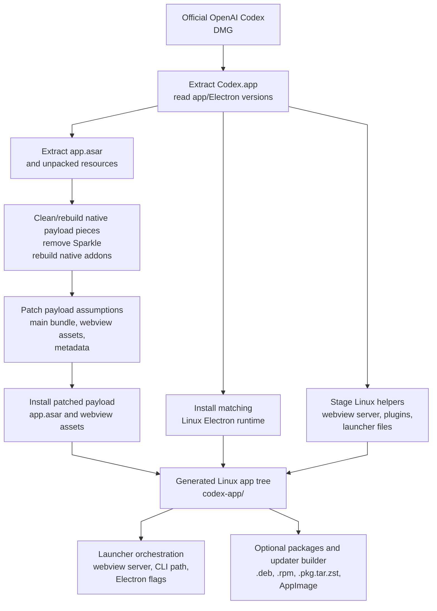

# Port Architecture

This document explains how the Linux port turns the official OpenAI Codex DMG
into a runnable Linux Electron app. It is an explanation, not a command
reference. For build commands, use the [Build and Run Guide](usage/build-and-run.md).

The central idea is simple: this repository does not emulate macOS or run macOS
binaries on Linux. It extracts the reusable Electron app payload, replaces or
rebuilds the native pieces for Linux, patches platform assumptions in the app
bundle, and launches the result with a Linux Electron runtime.

## Architecture At A Glance

This diagram is an orientation aid. It shows the main data dependencies, not
every shell command in order, a complete security model, or a complete process
graph.

The diagram separates the three recurring adaptation layers:

- **Replacement:** substitute Linux-native runtimes and binaries for macOS-native
  pieces.
- **Patching:** adapt the Electron app payload where the upstream bundle assumes
  macOS, Windows, or a different local integration model.
- **Orchestration:** start the generated app with Linux-specific launch, webview,
  CLI, package, and updater behavior.

## Project Boundaries

Three upstream or downstream boundaries matter when reading this repository:

- **Official OpenAI Codex DMG:** the macOS app artifact used as the app-generation
  input.
- **Linux-port upstream:** `ilysenko/codex-desktop-linux`, which owns the primary
  Linux conversion work and much of the runtime enablement.
- **This fork:** a local hardening and finishing fork that preserves the
  `codex-app` identity, distro-shaped install layout, updater policy, validation
  gates, and packaging polish.

These boundaries help route questions. App behavior that comes from the official
Codex service or account policy belongs outside this repository. Broad Linux
conversion mechanics usually start with the Linux-port upstream. Package
identity, local updater behavior, hardening, and distro layout belong here.

## Why The Conversion Is Possible

The conversion works because the official app is an Electron app. Electron apps
usually separate most application logic from the host operating system:

- JavaScript, HTML, CSS, and static assets live in the app payload, commonly in
  `resources/app.asar`.
- Electron itself is an operating-system-specific runtime with Chromium, Node.js,
  and desktop integration APIs.
- Native Node addons are compiled binaries loaded by the app's JavaScript.

The portable part is the app payload. The non-portable parts are the macOS
Electron runtime, macOS frameworks, `.dylib` files, `.node` addons compiled for
macOS, and macOS-only packages such as Sparkle. The port keeps the portable
payload and rebuilds or replaces the host-specific pieces.

This is a packaging and adaptation pipeline, not an ABI bridge. No generic layer
translates Mach-O binaries, AppKit APIs, or macOS syscalls into Linux behavior.

## The Three Adaptation Layers

### Replacement

Replacement handles pieces that must be native to Linux:

- The macOS Electron runtime is replaced with a Linux Electron runtime matching
  the detected Electron version and host architecture.
- Known native Node addons, currently including `better-sqlite3` and `node-pty`,
  are rebuilt for Linux against Electron's headers.
- macOS-only updater pieces, including `sparkle-darwin` and `sparkle.node`, are
  removed from the app payload.
- Linux helper binaries, plugin resources, package support files, and updater
  support files are built or staged under this fork's package identity.

### Patching

Patching handles app code and assets that are mostly portable but still contain
platform assumptions. The patcher works on the extracted app payload before it is
repacked into `app.asar`.

Patch descriptors target three phases:

- **`main-bundle`:** the generated Electron main-process bundle under
  `.vite/build/`.
- **`webview-asset`:** generated webview JavaScript assets under
  `webview/assets/`.
- **`extracted-app`:** structured files or bundles elsewhere in the extracted app
  tree, such as `package.json` metadata or updater bridge code.

The official app's JavaScript is minified. The patcher therefore matches stable
bundle shapes rather than pretty source code: string literals, platform
predicates, nearby Electron or Node API calls, imported module aliases, and
regex-captured minified variable names. This is practical, but it creates a real
maintenance risk called **bundle drift**: a new official app release can change
the bundle shape enough that a matcher no longer applies.

The patch framework records which patches applied. Some patch descriptors are
optional and can be skipped with a warning. Descriptors marked as required for
bundle compatibility fail closed in patch reports when the current bundle no
longer matches the required shape.

### Orchestration

Orchestration makes the generated app behave like a Linux desktop app:

- The generated `start.sh` prepares XDG config, cache, state, PID, and log paths.
- The launcher starts a local loopback webview server for extracted web assets,
  validates startup markers plus generated startup-asset hashes, and exports
  `ELECTRON_RENDERER_URL`.
- It discovers or preflights the Codex CLI before Electron starts.
- It chooses Linux Electron flags for sandboxing, Wayland or X11 behavior, GPU
  behavior, app identity, and side-by-side instances.
- Native packages add distro integration, desktop files, icons, packaged runtime
  helpers, and the `codex-app-updater` support path.

Orchestration is intentionally separate from the app payload. The app payload
contains upstream-derived behavior and Linux patches; the launcher and package
support decide how that payload starts and integrates with the host.

## Build Flow

The build sequence follows the same layers:

1. Download or reuse the official OpenAI Codex DMG.
2. Extract `Codex.app` from the DMG.
3. Detect the Codex app version and Electron version from app metadata.
4. Extract `Contents/Resources/app.asar`.
5. Copy unpacked resources from `app.asar.unpacked` when present.
6. Remove macOS-only updater modules.
7. Rebuild known native Node addons for Linux and the detected Electron version.
8. Apply Linux payload patches and port integration modules.
9. Repack the patched app payload as `app.asar`.
10. Download or reuse a matching Linux Electron runtime.
11. Copy the patched payload, webview assets, helper resources, and launcher into
    the generated `codex-app/` tree.
12. Optionally package the generated tree as `.deb`, `.rpm`, `.pkg.tar.zst`, or
    AppImage output.

This section explains the sequence. The exact commands and environment knobs
belong in the [Build and Run Guide](usage/build-and-run.md).

## Native And Binary Pieces

The pipeline identifies native pieces through known Electron app structure and
known package names, not through a universal binary translator.

The Electron runtime comes from app metadata. The installer reads the Electron
version from the extracted app, maps the host architecture to Electron's Linux
archive names, and downloads the matching Linux Electron zip.

Native Node addons come from the extracted `node_modules` tree. The installer
reads the addon versions from `package.json`, installs fresh addon sources in a
clean build directory, runs `@electron/rebuild` against the detected Electron
version and Electron headers, and copies the rebuilt Linux modules back into the
extracted payload.

Some helper binaries are staged separately from the ASAR payload. Browser and
Computer Use resources, Chrome native-messaging helpers, Node runtimes, and
other packaged support files can be copied from Linux-compatible upstream
resources, built from this repository, supplied by environment overrides, or
downloaded from a pinned runtime archive. Where the pipeline accepts a Linux
binary, it checks that the file is an ELF executable for the expected
architecture.

macOS-only pieces are removed or bypassed. Sparkle is a macOS updater framework,
so the port removes the Sparkle native module and routes package update behavior
through this fork's Linux updater path.

## Payload Patching

The app payload still needs patching even though most of it is JavaScript. Some
behaviors are platform-neutral business logic, but many desktop behaviors are
implemented in JavaScript branches that check `process.platform`, Electron
window options, plugin availability, update manager state, browser integration
paths, or webview UI gates.

Typical payload patches do one of the following:

- add Linux to a platform predicate that already supports macOS and Windows;
- replace a macOS or Windows-only desktop integration with a Linux implementation;
- set Linux-safe window defaults;
- preserve this fork's package and desktop identity;
- expose or hide integration UI according to local build settings and upstream
  account-side gates;
- bridge the official app's update UI to the Linux package updater.

Because the app bundle is generated and minified, patches do not rely on source
formatting. They search for stable syntax and runtime shapes. For example, a
patch may find a platform guard near an Electron `Tray` constructor, capture the
minified Electron module variable, then rewrite only that narrow expression.

This approach keeps the port practical without hand-editing generated output.
The durable fix always lives in the installer, patcher, launcher template,
package templates, updater code, or shared helpers. The generated `codex-app/`
tree is inspected for verification, not maintained as source.

## Runtime Launch

The generated app starts through `codex-app/start.sh`. For native packages, the
system launcher eventually execs `/opt/codex-app/start.sh`.

At launch time, the script:

1. resolves app identity and XDG paths;
2. prepares runtime directories and launcher logs;
3. loads packaged-only runtime behavior when installed from a native package;
4. reconciles stale app and webview PID files;
5. starts or reuses the local webview server;
6. verifies that the loopback webview origin serves expected startup markers and
   generated startup-asset hashes;
7. discovers or preflights the Codex CLI;
8. syncs bundled plugin resources where needed;
9. launches the Linux Electron binary with the patched app payload.

This launch model lets the port keep upstream-derived app code mostly inside the
Electron payload while Linux-specific runtime behavior stays in the launcher,
package support files, and updater service.

## What This Does Not Do

This port does not:

- run macOS binaries on Linux through an ABI compatibility layer;
- emulate AppKit, Mach-O loading, or macOS system services;
- bypass OpenAI account, rollout, entitlement, MFA, or service-side controls;
- make `codex-app/` the source of truth for durable fixes;
- automatically turn every official app feature into a complete Linux-native
  feature.

Those limits are part of the design. They keep the port focused on local
generation, packaging, runtime integration, and maintenance boundaries.

## Security And Maintenance Boundaries

The architecture has important trust and maintenance consequences:

- The DMG URL is mutable, so release and updater flows need reviewed hash and
  verification evidence.
- The generated Electron app is upstream-derived code plus local patches, so
  bundle drift can break patch assumptions.
- The local webview server, plugin resources, updater bridge, and desktop
  automation helpers create local trust boundaries that need targeted review.
- Native packages should install generated app files under package-managed roots
  while keeping user config, cache, and state under XDG paths.

Use these documents for deeper follow-up:

- [Threat Model](maintainers/threat-model.md) for attacker assumptions and
  security review scope.
- [Fork Divergences](maintainers/fork-divergences.md) for intentional differences
  from the Linux-port upstream.
- [Package and Runtime Maintenance](maintainers/package-runtime-maintenance.md)
  for source-of-truth files, package payloads, generated artifacts, and
  validation expectations.
- [Support and Issue Routing](usage/support-routing.md) for deciding whether an
  issue belongs with OpenAI, the Linux-port upstream, or this fork.

## Source Pointers

| Area | Primary files |
| --- | --- |
| Installer orchestration | `install.sh`, `scripts/lib/install-helpers.sh` |
| DMG extraction and version detection | `scripts/lib/dmg.sh` |
| ASAR extraction, native rebuild, and repack | `scripts/lib/asar-patch.sh`, `scripts/lib/native-modules.sh` |
| Payload patch registry | `scripts/patch-linux-window-ui.js`, `scripts/patches/`, `port-integrations/` |
| Webview extraction and startup asset integrity | `scripts/lib/webview-install.sh`, `launcher/webview-server.py` |
| Launcher orchestration | `launcher/start.sh.template` |
| Bundled plugin and helper staging | `scripts/lib/bundled-plugins.sh`, `plugins/openai-bundled/`, `computer-use-linux/` |
| Native package payload | `scripts/lib/package-common.sh`, `packaging/linux/`, `packaging/appimage/` |
| Local updater | `updater/`, `packaging/linux/codex-app-updater.service` |
